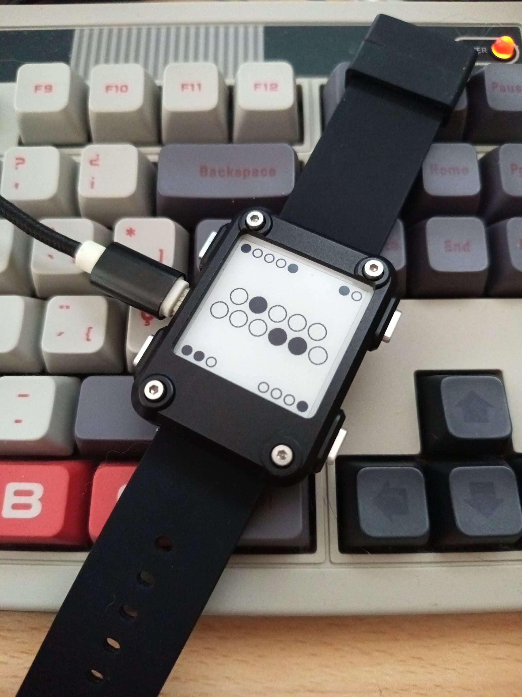

# BinaryWatch

A minimal binary watch face for [Watchy](https://watchy.sqfmi.com/), designed for the Watchy e-paper smartwatch.

  

## Features

- Displays hours and minutes using binary dots.
- Shows the day, weekday, month, and battery level in binary.
- Displays an approximate battery percentage.
- Press the back button on the watch face to show the bit weights and help reading the time.
- Disables unused Wi-Fi, Bluetooth, accelerometer, weather, and hourly vibration features to reduce power consumption.
- Configured for mainland Spain time and Spanish weekday/month abbreviations.
